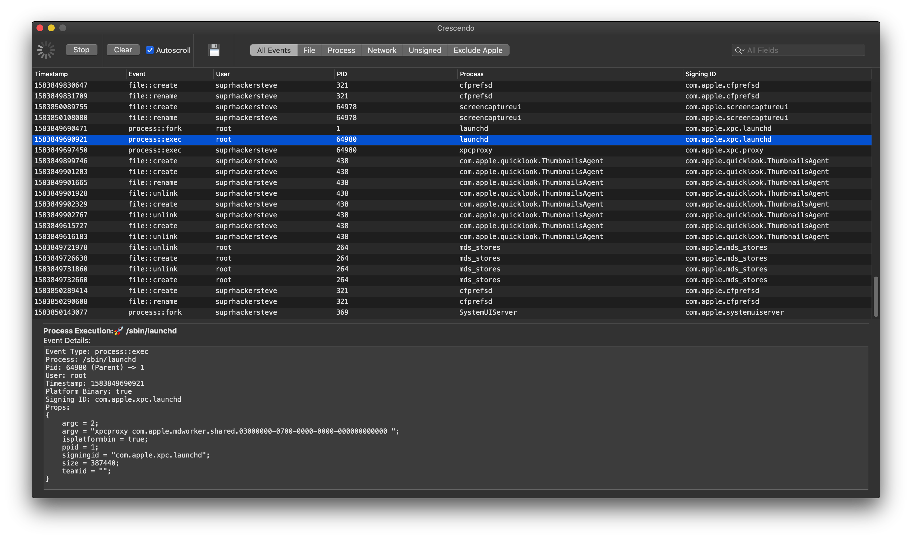
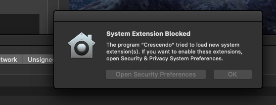
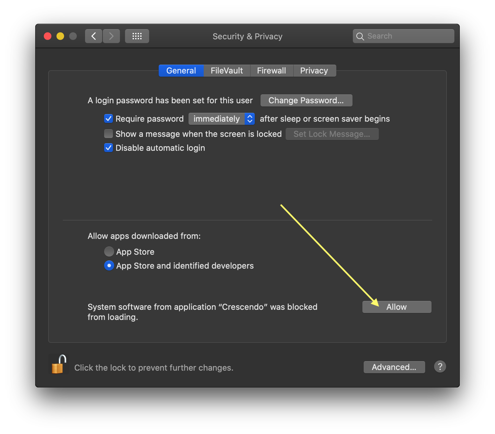
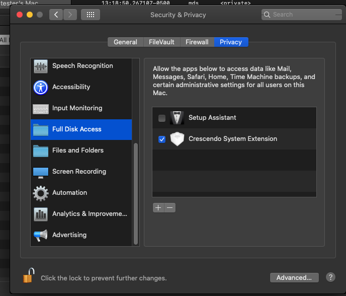

# Table of Contents

1. [Getting Started](#Getting-Started)
2. [Requirements](#requirements)
3. [Components](#Components)
4. [Testing and Development](#testing-and-development)
5. [Signing](#signing)
6. [Building](#building)
7. [Issues/Bugs/Features](#Issues/Bugs/Features)
8. [Troubleshooting](#Troubleshooting)
9. [TODO](#todo)

---



---

## Getting Started

Apple has introduced some new security mechanisms that we need to enable to get Crescendo running.

1. Ensure that you have moved the app to your /Applications director or the system extension will fail to load.
2. For the first run you will be prompted to approve the system extension, after clicking the "Start" button.

   _NOTE: I have noticed that there is an issue where System Preferences won't show an allow button. I assume this is some internal issue Apple needs to workout. Clicking back to System Preferences and navigating forward again seems to fix the issue._

   
   

3. You will need to enable Full Disk Access for the system extension.

   

---

## Requirements

Crescendo is only compatible with >=10.15.X and at least Xcode 10.

---

## Components

This project consists of three main components:

1. A system extension (CrescendoExtension)
2. A Framework wrapper around the Endpoint Security Framework (Crescendo)
3. An app for viewing events in a nice little user interface (CrescendoApp)

---

## Testing and Development

It is _highly_ recommended to test this code in a virtual machine with SIP disabled, since this project requires the endpoint-security entitlement, TCC, and proper signing when SIP is enabled.

1. Boot into Recovery mode on macOS
2. Disable SIP and AMFI

```
csrutil disable
nvram boot-args="amfi_get_out_of_my_way=0x1"
```

3. Reboot
4. Enable developer mode so our extensions will reload everytime we call `OSSystemExtensionManager.shared.submitRequest`

```
systemextensionsctl developer on
```

---

## Signing

If you wish to sign your own application, it is highly recommend to read Apple's documentation on [System Extension](https://developer.apple.com/documentation/systemextensions) requirements and [Notorization](https://developer.apple.com/documentation/xcode/notarizing_macos_software_before_distribution).

**Signing and entitlement is a non-trivial exercise.**

---

## Building

I have included my .xproj file in this release to get folks started. In the future I will likely move to using the new xcconfig file as this seems much more sane of an approach instead of commiting xproj files. If you wish to simply build the example cli application you can do so with Xcode.

In order to build this application and run it on a production macOS system, you will need the endpoint-security entitlement and a developer certificate from Apple.

The Crescendo framework can easily be bundled with any Swift application. I may move to CocoaPods in the future, but I am unfamiliar with them right now.

---

## Issues/Bugs/Features

Please feel free to raise an issue if you wish to see a feature added or encounter an issue. If you wish to contribute a pull request, please just ensure you run swiftlint over your code before contributing.

I will cut releases for the compiled + signed app and include them in the Releases tab as needed.

---

## Troubleshooting

- If you are running on a production Mac, you should _NOT_ disable SIP or AMFI. Those instructions are for developers wishing to make code changes.

- Did you enable the system extension by clicking the "Allow" button in `System Preferences -> Security & Privacy`? If not, you will not see any events.

- Did you enable full disk access in `System Preferences -> Security & Privacy -> Privacy Tab`? If not, you will not see any events.

* If you encounter any issues, open Console.app and search for `crescendo` or `<your_bundle_id>`/`com.suprhackersteve` as a filter, that should assist you in troubleshooting any potential issues. It is also a good idea to check in CrashReporter and see if the extension has crashed or exited with `fatalError`.

* If you wish to forcefully unload the system extension, there is a menu item named "Unload System Extension" that will unload it. This action may lead to odd side effects, only do it if you know what you are doing.

---

## TODO

1. Unit tests (need to figure out a reasonable way of running them)
2. Network events (tracking in [this issue](https://github.com/SuprHackerSteve/Crescendo/issues/1))
3. Better filtering and searching support for event data
4. Choose a packaging system for framework (Cocoapods, Swift Package Manager, etc)
5. Try to distribute system extension by itself using the new redistributable entitlement?
